# System Architecture Analysis

## Overview

- **Project**: /home/tom/github/wronai/markpact
- **Primary Language**: python
- **Languages**: python: 49, md: 38, yaml: 10, shell: 3, toml: 2
- **Analysis Mode**: static
- **Total Functions**: 998
- **Total Classes**: 81
- **Modules**: 106
- **Entry Points**: 737

## Architecture by Module

### SUMD
- **Functions**: 265
- **File**: `SUMD.md`

### project.map.toon
- **Functions**: 265
- **File**: `map.toon.yaml`

### examples.demo_live_markpact
- **Functions**: 29
- **Classes**: 2
- **File**: `demo_live_markpact.py`

### src.markpact.runtime.core_v3
- **Functions**: 29
- **Classes**: 4
- **File**: `core_v3.py`

### src.markpact.notebook_converter
- **Functions**: 25
- **Classes**: 2
- **File**: `notebook_converter.py`

### src.markpact.runtime.executors
- **Functions**: 23
- **Classes**: 11
- **File**: `executors.py`

### src.markpact.publish.pypi
- **Functions**: 21
- **File**: `pypi.py`

### src.markpact.syncer
- **Functions**: 21
- **Classes**: 1
- **File**: `syncer.py`

### src.markpact.runtime.core_v2
- **Functions**: 19
- **Classes**: 2
- **File**: `core_v2.py`

### src.markpact.runtime.state
- **Functions**: 17
- **Classes**: 2
- **File**: `state.py`

### src.markpact.docker_runner
- **Functions**: 16
- **File**: `docker_runner.py`

### src.markpact.auto_fix
- **Functions**: 15
- **File**: `auto_fix.py`

### src.markpact.runtime.plugins
- **Functions**: 14
- **Classes**: 3
- **File**: `plugins.py`

### src.markpact.publish.helpers
- **Functions**: 13
- **File**: `helpers.py`

### src.markpact.config
- **Functions**: 12
- **File**: `config.py`

### src.markpact.packer
- **Functions**: 12
- **Classes**: 1
- **File**: `packer.py`

### src.markpact.runtime.core
- **Functions**: 12
- **Classes**: 2
- **File**: `core.py`

### src.markpact.cli.sync_cmd
- **Functions**: 11
- **File**: `sync_cmd.py`

### src.markpact.generator
- **Functions**: 11
- **Classes**: 1
- **File**: `generator.py`

### src.markpact.converter
- **Functions**: 10
- **Classes**: 2
- **File**: `converter.py`

## Key Entry Points

Main execution flows into the system:

### src.markpact.runtime.cli.main
- **Calls**: argparse.ArgumentParser, parser.add_argument, parser.add_argument, parser.add_argument, parser.add_argument, parser.add_argument, parser.add_argument, parser.add_argument

### src.markpact.cli.config_cmd.handle_config_cli
> Handle config subcommand with its own parser
- **Calls**: argparse.ArgumentParser, parser.add_argument, parser.add_argument, parser.add_argument, parser.add_argument, parser.add_argument, parser.add_argument, parser.add_argument

### src.markpact.tester.run_service_with_tests
> Start a service, run tests, and return results.

Returns:
    Tuple of (exit_code, test_suite)
- **Calls**: os.environ.copy, str, sandbox.venv_bin.exists, run_command.replace, re.sub, subprocess.Popen, str, README.print

### src.markpact.runtime.parser.MarkpactParser.parse
> Parse markdown content and extract markpact blocks.

Args:
    content: Markdown content as string
    
Returns:
    List of parsed Block objects
- **Calls**: self.MARKPACT_RE.finditer, set, self.MARKPACT_RE.finditer, self.CODE_BLOCK_RE.finditer, self.blocks.sort, match.group, match.group, self._parse_block_type

### src.markpact.cli.convert_cmd._handle_llm_generation
> Handle --prompt or --example LLM generation. Returns (exit_code, readme_path_or_none).
- **Calls**: SUMD.init_env, SUMD.load_env, GeneratorConfig, README.print, README.print, output_path.parent.mkdir, output_path.write_text, README.print

### src.markpact.runtime.core_v2.RuntimeV2.execute
> Execute all or filtered steps with idempotency, retry, rollback.
- **Calls**: self.parse, self._process_blocks, self.state_manager.start_deployment, self.state_manager.end_deployment, self._print_summary, re.compile, README.print, README.print

### src.markpact.tester.run_shell_tests
> Run shell command tests.
- **Calls**: os.environ.copy, sandbox.venv_bin.exists, None.splitlines, TestSuite, str, line.strip, time.time, test_body.strip

### src.markpact.runtime.core_v3.RuntimeV3.reconcile
> Reconcile current state with desired state.

This is the main v3 entry point - instead of just executing steps,
it checks current state and only appli
- **Calls**: time.time, self.parse, self._process_blocks, self._filter_steps, len, enumerate, ExecutionSummary, README.print

### src.markpact.template.resolve_template
> Resolve template placeholders in a block body.

Args:
    body: The template text with placeholders.
    secrets: Pre-loaded secrets dict (KEY→VALUE).
- **Calls**: _ASK_RE.sub, _ENV_RE.sub, _VAR_RE.sub, m.group, m.group, os.environ.get, warnings.append, m.group

### src.markpact.packer.pack_directory
> Pack a directory into markpact README.md format.

Args:
    source_dir: Directory to pack
    output: Output README.md path (default: source_dir/READM
- **Calls**: None.resolve, DEFAULT_EXCLUDE.copy, src.markpact.packer._collect_files, src.markpact.packer._generate_readme_content, src.markpact.packer._write_output, PackResult, src.exists, PackResult

### src.markpact.converter.convert_markdown_to_markpact
> Convert regular Markdown to markpact format.

Analyzes code blocks and converts them to markpact:* format based on heuristics.
- **Calls**: ConversionResult, re.search, re.compile, pattern.sub, result.changes.append, match.group, src.markpact.converter.detect_block_type, result.blocks.append

### src.markpact.runtime.plugins.PluginLoader.load_from_path
> Load plugins from a filesystem path.

The path can be:
- A directory containing plugin packages
- A single plugin file

Args:
    path: Path to plugin
- **Calls**: None.resolve, self._loaded_paths.add, path.is_dir, path.exists, README.print, path.iterdir, None.expanduser, path.is_file

### src.markpact.runtime.executors.ExecutorRegistry._register_defaults
> Register default built-in executors.
- **Calls**: self.register, self.register, self.register, self.register, self.register, self.register, self.register, self.register

### src.markpact.syncer.sync_readme_recursive
> Sync README and all included sub-READMEs recursively.

Finds ``<!-- markpact:include path=sub/README.md -->`` directives
and syncs each referenced fil
- **Calls**: None.resolve, None.resolve, set, _sync_one, str, seen.add, src.markpact.syncer.sync_readme, results.append

### src.markpact.syncer.print_sync_report
> Print a formatted report of the sync operation.
- **Calls**: README.print, README.print, README.print, README.print, README.print, README.print, README.print, README.print

### examples.demo_live_markpact.main
- **Calls**: argparse.ArgumentParser, parser.add_argument, parser.add_argument, parser.add_argument, parser.add_argument, parser.parse_args, examples.demo_live_markpact.run_live, examples.demo_live_markpact.list_prompts

### src.markpact.runtime.core.Runtime._execute_step
> Execute a single step.
- **Calls**: time.time, self.executors.get, README.print, README.print, StepResult, README.print, StepResult, executor.execute

### src.markpact.publish.helpers.prompt_publish_config
> Interactively ask user for missing or important publish fields.
- **Calls**: README.print, README.print, ask, ask, ask, ask, ask, ask

### src.markpact.cli.pack_cmd.handle_pack_cli
> Handle pack subcommand - pack directory into markpact README.
- **Calls**: argparse.ArgumentParser, parser.add_argument, parser.add_argument, parser.add_argument, parser.add_argument, parser.add_argument, parser.add_argument, parser.add_argument

### src.markpact.publish.main.parse_publish_block
> Parse publish block content into config.

Args:
    block_body: The body of the publish block
    meta: The meta line (first line after markpact:publi
- **Calls**: all_lines.extend, PublishConfig, all_lines.append, None.splitlines, line.strip, None.lower, None.strip, line.startswith

### src.markpact.runtime.core_v3.FactsGatherer._eval_condition
> Evaluate a single condition.
- **Calls**: condition.startswith, condition.startswith, condition.startswith, condition.startswith, self._check_command_succeeds, self._check_docker_installed, self._check_container_running, self._check_file_exists

### src.markpact.runtime.core_v2.RuntimeV2._execute_step_single
> Execute a single step attempt.
- **Calls**: time.time, self.executors.get, README.print, StepResult, StepResult, executor.execute, StepResult, README.print

### src.markpact.auto_fix.run_with_auto_fix_llm
> Run command with automatic error detection and fixing (with optional LLM).

Args:
    cmd: Command to run
    sandbox: Sandbox instance
    readme_pat
- **Calls**: src.markpact.auto_fix._setup_env_with_venv, range, src.markpact.auto_fix.detect_error_type, README.print, src.markpact.auto_fix._run_subprocess, README.print, README.print, src.markpact.auto_fix._handle_port_error

### src.markpact.cli.sync_cmd.handle_sync_cli
> Handle sync subcommand — thin orchestrator dispatching to steps.

CC: ~8 (parse → resolve → dispatch info mode or sync mode).
- **Calls**: src.markpact.cli.sync_cmd._build_sync_parser, parser.parse_args, src.markpact.cli.sync_cmd._resolve_paths, readme_path.read_text, src.markpact.cli.sync_cmd._execute_single_sync, src.markpact.cli.sync_cmd._handle_backups_mode, src.markpact.cli.sync_cmd._handle_rollback_mode, src.markpact.cli.sync_cmd._handle_list_mode

### src.markpact.runtime.executors.DockerExecutor._wait_healthy
> Wait for containers to be healthy.
- **Calls**: step.params.get, step.params.get, time.time, ExecutionError, time.sleep, time.time, self._run_ssh, self._run_local

### src.markpact.runtime.executors.HttpExecutor.execute
- **Calls**: step.params.get, step.params.get, range, ExecutionError, step.params.get, step.params.get, ExecutionError, urllib.request.Request

### src.markpact.publish.pypi.publish_pypi
> Publish package to PyPI.
- **Calls**: src.markpact.publish.pypi._normalize_package_name, src.markpact.publish.pypi._determine_base_path, src.markpact.publish.pypi.generate_pyproject_toml, pyproject_path.exists, src.markpact.publish.pypi._copy_readme, src.markpact.publish.pypi._build_package, src.markpact.publish.pypi._check_pypi_credentials, src.markpact.publish.pypi._upload_to_pypi

### examples.demo_live_markpact._save_outputs
> Save README and PDF outputs.
- **Calls**: readme_path.write_text, examples.demo_live_markpact.ok, README.print, str, pdf.page_no, range, pdf.output, examples.demo_live_markpact.ok

### src.markpact.runtime.core_v3.RuntimeV3._rollback
> Rollback executed steps in reverse order.
- **Calls**: reversed, reversed, README.print, README.print, README.print, self._exec_remote, README.print, self._execute_step

### src.markpact.cli.helpers._parse_blocks_to_state
> Parse blocks and extract state. Returns state dict with error key if failed.
- **Calls**: block.get_path, src.markpact.cli.helpers._resolve_file_body, README.print, README.print, sandbox.write_file, None.extend, block.get_meta_value, README.print

## Process Flows

Key execution flows identified:

### Flow 1: main
```
main [src.markpact.runtime.cli]
```

### Flow 2: handle_config_cli
```
handle_config_cli [src.markpact.cli.config_cmd]
```

### Flow 3: run_service_with_tests
```
run_service_with_tests [src.markpact.tester]
```

### Flow 4: parse
```
parse [src.markpact.runtime.parser.MarkpactParser]
```

### Flow 5: _handle_llm_generation
```
_handle_llm_generation [src.markpact.cli.convert_cmd]
  └─ →> init_env
  └─ →> load_env
  └─ →> print
```

### Flow 6: execute
```
execute [src.markpact.runtime.core_v2.RuntimeV2]
```

### Flow 7: run_shell_tests
```
run_shell_tests [src.markpact.tester]
```

### Flow 8: reconcile
```
reconcile [src.markpact.runtime.core_v3.RuntimeV3]
```

### Flow 9: resolve_template
```
resolve_template [src.markpact.template]
```

### Flow 10: pack_directory
```
pack_directory [src.markpact.packer]
  └─> _collect_files
      └─ →> print
  └─> _generate_readme_content
      └─> _get_language
```

## Key Classes

### src.markpact.runtime.core_v3.RuntimeV3
> Markpact Runtime v3: State Reconciliation Engine

Terraform-style deployment with:
- Step hashing fo
- **Methods**: 19
- **Key Methods**: src.markpact.runtime.core_v3.RuntimeV3.__init__, src.markpact.runtime.core_v3.RuntimeV3.parse, src.markpact.runtime.core_v3.RuntimeV3._process_blocks, src.markpact.runtime.core_v3.RuntimeV3._load_config, src.markpact.runtime.core_v3.RuntimeV3._load_steps, src.markpact.runtime.core_v3.RuntimeV3._load_rollback, src.markpact.runtime.core_v3.RuntimeV3.plan, src.markpact.runtime.core_v3.RuntimeV3.reconcile, src.markpact.runtime.core_v3.RuntimeV3._should_execute, src.markpact.runtime.core_v3.RuntimeV3._compute_step_hash

### src.markpact.runtime.core_v2.RuntimeV2
> Production-grade runtime for executing markpact deployments.

Features:
- Pydantic validation
- Idem
- **Methods**: 19
- **Key Methods**: src.markpact.runtime.core_v2.RuntimeV2.__init__, src.markpact.runtime.core_v2.RuntimeV2._load_plugins, src.markpact.runtime.core_v2.RuntimeV2.parse, src.markpact.runtime.core_v2.RuntimeV2.execute, src.markpact.runtime.core_v2.RuntimeV2._should_run_step, src.markpact.runtime.core_v2.RuntimeV2._execute_step_with_retry, src.markpact.runtime.core_v2.RuntimeV2._execute_step_single, src.markpact.runtime.core_v2.RuntimeV2._rollback, src.markpact.runtime.core_v2.RuntimeV2._get_ssh_manager, src.markpact.runtime.core_v2.RuntimeV2._process_blocks

### src.markpact.runtime.state.StateManager
> Manages deployment state for idempotency.

Persists state to JSON file for resume capability.
- **Methods**: 12
- **Key Methods**: src.markpact.runtime.state.StateManager.__init__, src.markpact.runtime.state.StateManager._load, src.markpact.runtime.state.StateManager._save, src.markpact.runtime.state.StateManager.is_step_done, src.markpact.runtime.state.StateManager.mark_step_done, src.markpact.runtime.state.StateManager.mark_failed, src.markpact.runtime.state.StateManager.clear_failed, src.markpact.runtime.state.StateManager.start_deployment, src.markpact.runtime.state.StateManager.end_deployment, src.markpact.runtime.state.StateManager.reset

### src.markpact.runtime.core.Runtime
> Main runtime for executing markpact markdown files.

Supports multiple execution backends via plugin
- **Methods**: 12
- **Key Methods**: src.markpact.runtime.core.Runtime.__init__, src.markpact.runtime.core.Runtime._load_plugins, src.markpact.runtime.core.Runtime.parse, src.markpact.runtime.core.Runtime.execute, src.markpact.runtime.core.Runtime._process_blocks, src.markpact.runtime.core.Runtime._process_config, src.markpact.runtime.core.Runtime._process_steps, src.markpact.runtime.core.Runtime._process_run_block, src.markpact.runtime.core.Runtime._execute_step, src.markpact.runtime.core.Runtime._print_summary

### src.markpact.runtime.plugins.PluginLoader
> Loads plugins from various sources.
- **Methods**: 10
- **Key Methods**: src.markpact.runtime.plugins.PluginLoader.__init__, src.markpact.runtime.plugins.PluginLoader.load_from_path, src.markpact.runtime.plugins.PluginLoader.load_from_module, src.markpact.runtime.plugins.PluginLoader._load_from_directory, src.markpact.runtime.plugins.PluginLoader._load_from_file, src.markpact.runtime.plugins.PluginLoader._extract_plugin_from_module, src.markpact.runtime.plugins.PluginLoader.get, src.markpact.runtime.plugins.PluginLoader.list, src.markpact.runtime.plugins.PluginLoader.get_all, src.markpact.runtime.plugins.PluginLoader.clear

### src.markpact.runtime.core_v3.FactsGatherer
> Gathers current state facts from target host.

This enables true idempotency by checking actual stat
- **Methods**: 9
- **Key Methods**: src.markpact.runtime.core_v3.FactsGatherer.__init__, src.markpact.runtime.core_v3.FactsGatherer.clear_cache, src.markpact.runtime.core_v3.FactsGatherer.check, src.markpact.runtime.core_v3.FactsGatherer._eval_condition, src.markpact.runtime.core_v3.FactsGatherer._check_docker_installed, src.markpact.runtime.core_v3.FactsGatherer._check_container_running, src.markpact.runtime.core_v3.FactsGatherer._check_file_exists, src.markpact.runtime.core_v3.FactsGatherer._check_dir_exists, src.markpact.runtime.core_v3.FactsGatherer._check_command_succeeds

### src.markpact.sandbox.Sandbox
> Manages sandbox directory for markpact execution
- **Methods**: 8
- **Key Methods**: src.markpact.sandbox.Sandbox.__init__, src.markpact.sandbox.Sandbox.venv_bin, src.markpact.sandbox.Sandbox.venv_pip, src.markpact.sandbox.Sandbox.venv_python, src.markpact.sandbox.Sandbox.has_venv, src.markpact.sandbox.Sandbox.write_file, src.markpact.sandbox.Sandbox.write_requirements, src.markpact.sandbox.Sandbox.clean

### src.markpact.runtime.executors.DockerExecutor
> Execute Docker Compose operations.
- **Methods**: 7
- **Key Methods**: src.markpact.runtime.executors.DockerExecutor.name, src.markpact.runtime.executors.DockerExecutor.execute, src.markpact.runtime.executors.DockerExecutor._compose_up, src.markpact.runtime.executors.DockerExecutor._compose_down, src.markpact.runtime.executors.DockerExecutor._wait_healthy, src.markpact.runtime.executors.DockerExecutor._run_local, src.markpact.runtime.executors.DockerExecutor._run_ssh
- **Inherits**: Executor

### src.markpact.runtime.ssh_manager.SSHSessionManager
> Manages persistent SSH sessions for performance.

Avoids reconnecting for each step - reuses single 
- **Methods**: 6
- **Key Methods**: src.markpact.runtime.ssh_manager.SSHSessionManager.__init__, src.markpact.runtime.ssh_manager.SSHSessionManager.connect, src.markpact.runtime.ssh_manager.SSHSessionManager.exec_command, src.markpact.runtime.ssh_manager.SSHSessionManager.close, src.markpact.runtime.ssh_manager.SSHSessionManager.session, src.markpact.runtime.ssh_manager.SSHSessionManager.__del__

### src.markpact.runtime.state.ConditionChecker
> Check step conditions (when/skip_if).
- **Methods**: 5
- **Key Methods**: src.markpact.runtime.state.ConditionChecker.__init__, src.markpact.runtime.state.ConditionChecker.check_when, src.markpact.runtime.state.ConditionChecker.check_skip_if, src.markpact.runtime.state.ConditionChecker._is_docker_running, src.markpact.runtime.state.ConditionChecker._is_container_running

### src.markpact.runtime.plugins.Plugin
> Base class for plugins.

Plugins provide custom executors for specific actions.
- **Methods**: 5
- **Key Methods**: src.markpact.runtime.plugins.Plugin.name, src.markpact.runtime.plugins.Plugin.version, src.markpact.runtime.plugins.Plugin.execute, src.markpact.runtime.plugins.Plugin.initialize, src.markpact.runtime.plugins.Plugin.shutdown
- **Inherits**: ABC

### src.markpact.runtime.executors.ShellExecutor
> Execute shell commands locally or via SSH with persistent sessions.
- **Methods**: 5
- **Key Methods**: src.markpact.runtime.executors.ShellExecutor.name, src.markpact.runtime.executors.ShellExecutor.execute, src.markpact.runtime.executors.ShellExecutor._run_local, src.markpact.runtime.executors.ShellExecutor._run_ssh_persistent, src.markpact.runtime.executors.ShellExecutor._run_ssh_subprocess
- **Inherits**: Executor

### src.markpact.runtime.executors.ExecutorRegistry
> Registry of available executors.
- **Methods**: 5
- **Key Methods**: src.markpact.runtime.executors.ExecutorRegistry.__init__, src.markpact.runtime.executors.ExecutorRegistry._register_defaults, src.markpact.runtime.executors.ExecutorRegistry.register, src.markpact.runtime.executors.ExecutorRegistry.get, src.markpact.runtime.executors.ExecutorRegistry.list

### src.markpact.runtime.parser.MarkpactParser
> Parser for markpact markdown files.

Extracts markpact blocks from markdown files:
- ```markpact:con
- **Methods**: 5
- **Key Methods**: src.markpact.runtime.parser.MarkpactParser.__init__, src.markpact.runtime.parser.MarkpactParser.parse, src.markpact.runtime.parser.MarkpactParser._parse_block_type, src.markpact.runtime.parser.MarkpactParser.get_blocks_by_type, src.markpact.runtime.parser.MarkpactParser.get_first_block

### src.markpact.tester.TestSuite
> Collection of test results
- **Methods**: 4
- **Key Methods**: src.markpact.tester.TestSuite.passed, src.markpact.tester.TestSuite.failed, src.markpact.tester.TestSuite.total, src.markpact.tester.TestSuite.print_summary

### src.markpact.runtime.models.Step
> Pydantic-validated deployment step.

Includes idempotency conditions (when/skip_if), retry logic, ro
- **Methods**: 4
- **Key Methods**: src.markpact.runtime.models.Step.validate_risk, src.markpact.runtime.models.Step.positive_int, src.markpact.runtime.models.Step.from_dict, src.markpact.runtime.models.Step.to_dict
- **Inherits**: BaseModel

### src.markpact.runtime.plugins.BrowserReloadPlugin
> Plugin to reload browser via CDP (Chrome DevTools Protocol).
- **Methods**: 3
- **Key Methods**: src.markpact.runtime.plugins.BrowserReloadPlugin.name, src.markpact.runtime.plugins.BrowserReloadPlugin.version, src.markpact.runtime.plugins.BrowserReloadPlugin.execute
- **Inherits**: Plugin

### src.markpact.runtime.executors.Executor
> Base class for action executors.
- **Methods**: 3
- **Key Methods**: src.markpact.runtime.executors.Executor.name, src.markpact.runtime.executors.Executor.execute, src.markpact.runtime.executors.Executor.validate
- **Inherits**: ABC

### src.markpact.runtime.executors.RsyncExecutor
> Execute rsync operations.
- **Methods**: 2
- **Key Methods**: src.markpact.runtime.executors.RsyncExecutor.name, src.markpact.runtime.executors.RsyncExecutor.execute
- **Inherits**: Executor

### src.markpact.runtime.executors.ScpExecutor
> Execute SCP copy operations.
- **Methods**: 2
- **Key Methods**: src.markpact.runtime.executors.ScpExecutor.name, src.markpact.runtime.executors.ScpExecutor.execute
- **Inherits**: Executor

## Data Transformation Functions

Key functions that process and transform data:

### SUMD._step_parse_blocks

### SUMD._step_validate_blocks

### SUMD._pdf_parse

### SUMD._pdf_validate

### SUMD._run_subprocess

### SUMD._parse_blocks_to_state

### SUMD._parse_pypirc_section

### SUMD._process_block

### SUMD._parse_main_args

### SUMD._process_readme

### SUMD._build_sync_parser

### SUMD.parse_blocks

### SUMD.parse_blocks_recursive

### SUMD._handle_list_notebook_formats

### SUMD.convert_markdown_to_markpact

### SUMD.parse_publish_block

### SUMD.detect_format

### SUMD.parse_jupyter

### SUMD._parse_rmd_yaml_front_matter

### SUMD._parse_rmd_code_chunks

### SUMD.parse_rmarkdown

### SUMD._parse_quarto_yaml_front_matter

### SUMD._parse_quarto_code_chunks

### SUMD.parse_quarto

### SUMD.parse_zeppelin

## Behavioral Patterns

### recursion_list
- **Type**: recursion
- **Confidence**: 0.90
- **Functions**: src.markpact.runtime.plugins.PluginLoader.list

### recursion_list
- **Type**: recursion
- **Confidence**: 0.90
- **Functions**: src.markpact.runtime.executors.ExecutorRegistry.list

### recursion_parse_blocks_recursive
- **Type**: recursion
- **Confidence**: 0.90
- **Functions**: src.markpact.parser.parse_blocks_recursive

### state_machine_StateManager
- **Type**: state_machine
- **Confidence**: 0.70
- **Functions**: src.markpact.runtime.state.StateManager.__init__, src.markpact.runtime.state.StateManager._load, src.markpact.runtime.state.StateManager._save, src.markpact.runtime.state.StateManager.is_step_done, src.markpact.runtime.state.StateManager.mark_step_done

### state_machine_ConditionChecker
- **Type**: state_machine
- **Confidence**: 0.70
- **Functions**: src.markpact.runtime.state.ConditionChecker.__init__, src.markpact.runtime.state.ConditionChecker.check_when, src.markpact.runtime.state.ConditionChecker.check_skip_if, src.markpact.runtime.state.ConditionChecker._is_docker_running, src.markpact.runtime.state.ConditionChecker._is_container_running

### state_machine_RuntimeV3
- **Type**: state_machine
- **Confidence**: 0.70
- **Functions**: src.markpact.runtime.core_v3.RuntimeV3.__init__, src.markpact.runtime.core_v3.RuntimeV3.parse, src.markpact.runtime.core_v3.RuntimeV3._process_blocks, src.markpact.runtime.core_v3.RuntimeV3._load_config, src.markpact.runtime.core_v3.RuntimeV3._load_steps

## Public API Surface

Functions exposed as public API (no underscore prefix):

- `src.markpact.runtime.cli.main` - 61 calls
- `src.markpact.cli.config_cmd.handle_config_cli` - 35 calls
- `src.markpact.tester.run_service_with_tests` - 35 calls
- `src.markpact.runtime.parser.MarkpactParser.parse` - 32 calls
- `src.markpact.notebook_converter.parse_zeppelin` - 30 calls
- `src.markpact.notebook_converter.parse_databricks` - 30 calls
- `src.markpact.runtime.core_v2.RuntimeV2.execute` - 25 calls
- `src.markpact.notebook_converter.parse_jupyter` - 24 calls
- `src.markpact.tester.run_shell_tests` - 23 calls
- `examples.demo_live_markpact.run_live` - 22 calls
- `src.markpact.tester.run_http_test` - 21 calls
- `src.markpact.runtime.core_v3.RuntimeV3.reconcile` - 21 calls
- `src.markpact.template.resolve_template` - 20 calls
- `src.markpact.packer.pack_directory` - 20 calls
- `src.markpact.converter.convert_markdown_to_markpact` - 19 calls
- `src.markpact.runtime.plugins.PluginLoader.load_from_path` - 18 calls
- `src.markpact.parser.parse_blocks` - 18 calls
- `src.markpact.parser.parse_blocks_recursive` - 18 calls
- `src.markpact.syncer.sync_readme_recursive` - 18 calls
- `src.markpact.syncer.print_sync_report` - 18 calls
- `examples.demo_live_markpact.show_menu` - 18 calls
- `examples.demo_live_markpact.main` - 18 calls
- `src.markpact.notebook_converter.notebook_to_markpact` - 16 calls
- `src.markpact.publish.helpers.prompt_publish_config` - 16 calls
- `src.markpact.cli.pack_cmd.handle_pack_cli` - 15 calls
- `src.markpact.publish.main.parse_publish_block` - 15 calls
- `src.markpact.syncer.sync_readme` - 15 calls
- `src.markpact.auto_fix.run_with_auto_fix_llm` - 14 calls
- `src.markpact.cli.sync_cmd.handle_sync_cli` - 14 calls
- `src.markpact.runtime.executors.HttpExecutor.execute` - 14 calls
- `src.markpact.publish.pypi.publish_pypi` - 14 calls
- `src.markpact.config.load_env` - 12 calls
- `src.markpact.runtime.ssh_manager.SSHSessionManager.exec_command` - 12 calls
- `src.markpact.publish.helpers.ensure_publish_block_in_readme` - 12 calls
- `src.markpact.publish.docker_pub.publish_docker` - 12 calls
- `src.markpact.tester.http_request` - 12 calls
- `src.markpact.syncer.find_untracked_files` - 12 calls
- `src.markpact.syncer.add_untracked_blocks` - 12 calls
- `src.markpact.packer.print_pack_report` - 12 calls
- `src.markpact.runtime.models.Step.from_dict` - 12 calls

## System Interactions

How components interact:

```mermaid
graph TD
    main --> ArgumentParser
    main --> add_argument
    handle_config_cli --> ArgumentParser
    handle_config_cli --> add_argument
    run_service_with_tes --> copy
    run_service_with_tes --> str
    run_service_with_tes --> exists
    run_service_with_tes --> replace
    run_service_with_tes --> sub
    parse --> finditer
    parse --> set
    parse --> sort
    _handle_llm_generati --> init_env
    _handle_llm_generati --> load_env
    _handle_llm_generati --> GeneratorConfig
    _handle_llm_generati --> print
    execute --> parse
    execute --> _process_blocks
    execute --> start_deployment
    execute --> end_deployment
    execute --> _print_summary
    run_shell_tests --> copy
    run_shell_tests --> exists
    run_shell_tests --> splitlines
    run_shell_tests --> TestSuite
    run_shell_tests --> str
    reconcile --> time
    reconcile --> parse
    reconcile --> _process_blocks
    reconcile --> _filter_steps
```



## Reverse Engineering Guidelines

1. **Entry Points**: Start analysis from the entry points listed above
2. **Core Logic**: Focus on classes with many methods
3. **Data Flow**: Follow data transformation functions
4. **Process Flows**: Use the flow diagrams for execution paths
5. **API Surface**: Public API functions reveal the interface

## Context for LLM

Maintain the identified architectural patterns and public API surface when suggesting changes.