# System Architecture Analysis

## Overview

- **Project**: /home/tom/github/wronai/markpact
- **Primary Language**: python
- **Languages**: python: 49, shell: 3
- **Analysis Mode**: static
- **Total Functions**: 417
- **Total Classes**: 59
- **Modules**: 52
- **Entry Points**: 170

## Architecture by Module

### src.markpact.runtime.core_v3
- **Functions**: 29
- **Classes**: 4
- **File**: `core_v3.py`

### examples.demo_live_markpact
- **Functions**: 29
- **Classes**: 2
- **File**: `demo_live_markpact.py`

### src.markpact.notebook_converter
- **Functions**: 25
- **Classes**: 2
- **File**: `notebook_converter.py`

### src.markpact.runtime.executors
- **Functions**: 23
- **Classes**: 11
- **File**: `executors.py`

### src.markpact.publish.pypi
- **Functions**: 21
- **File**: `pypi.py`

### src.markpact.syncer
- **Functions**: 21
- **Classes**: 1
- **File**: `syncer.py`

### src.markpact.runtime.core_v2
- **Functions**: 19
- **Classes**: 2
- **File**: `core_v2.py`

### src.markpact.runtime.state
- **Functions**: 17
- **Classes**: 2
- **File**: `state.py`

### src.markpact.docker_runner
- **Functions**: 16
- **File**: `docker_runner.py`

### src.markpact.auto_fix
- **Functions**: 15
- **File**: `auto_fix.py`

### src.markpact.runtime.plugins
- **Functions**: 14
- **Classes**: 3
- **File**: `plugins.py`

### src.markpact.publish.helpers
- **Functions**: 13
- **File**: `helpers.py`

### src.markpact.config
- **Functions**: 12
- **File**: `config.py`

### src.markpact.packer
- **Functions**: 12
- **Classes**: 1
- **File**: `packer.py`

### src.markpact.runtime.core
- **Functions**: 12
- **Classes**: 2
- **File**: `core.py`

### src.markpact.cli.sync_cmd
- **Functions**: 11
- **File**: `sync_cmd.py`

### src.markpact.generator
- **Functions**: 11
- **Classes**: 1
- **File**: `generator.py`

### src.markpact.converter
- **Functions**: 10
- **Classes**: 2
- **File**: `converter.py`

### src.markpact.cli.run_cmd
- **Functions**: 7
- **File**: `run_cmd.py`

### src.markpact.tester
- **Functions**: 7
- **Classes**: 2
- **File**: `tester.py`

## Key Entry Points

Main execution flows into the system:

### src.markpact.runtime.cli.main
- **Calls**: argparse.ArgumentParser, parser.add_argument, parser.add_argument, parser.add_argument, parser.add_argument, parser.add_argument, parser.add_argument, parser.add_argument

### src.markpact.runtime.parser.MarkpactParser.parse
> Parse markdown content and extract markpact blocks.

Args:
    content: Markdown content as string
    
Returns:
    List of parsed Block objects
- **Calls**: self.MARKPACT_RE.finditer, set, self.MARKPACT_RE.finditer, self.CODE_BLOCK_RE.finditer, self.blocks.sort, match.group, match.group, self._parse_block_type

### src.markpact.runtime.core_v2.RuntimeV2.execute
> Execute all or filtered steps with idempotency, retry, rollback.
- **Calls**: self.parse, self._process_blocks, self.state_manager.start_deployment, self.state_manager.end_deployment, self._print_summary, re.compile, print, print

### src.markpact.runtime.core_v3.RuntimeV3.reconcile
> Reconcile current state with desired state.

This is the main v3 entry point - instead of just executing steps,
it checks current state and only appli
- **Calls**: time.time, self.parse, self._process_blocks, self._filter_steps, len, enumerate, ExecutionSummary, print

### src.markpact.runtime.plugins.PluginLoader.load_from_path
> Load plugins from a filesystem path.

The path can be:
- A directory containing plugin packages
- A single plugin file

Args:
    path: Path to plugin
- **Calls**: None.resolve, self._loaded_paths.add, path.is_dir, path.exists, print, path.iterdir, None.expanduser, path.is_file

### src.markpact.runtime.executors.ExecutorRegistry._register_defaults
> Register default built-in executors.
- **Calls**: self.register, self.register, self.register, self.register, self.register, self.register, self.register, self.register

### examples.demo_live_markpact.main
- **Calls**: argparse.ArgumentParser, parser.add_argument, parser.add_argument, parser.add_argument, parser.add_argument, parser.parse_args, examples.demo_live_markpact.run_live, examples.demo_live_markpact.list_prompts

### src.markpact.runtime.core.Runtime._execute_step
> Execute a single step.
- **Calls**: time.time, self.executors.get, print, print, StepResult, print, StepResult, executor.execute

### src.markpact.runtime.core_v3.FactsGatherer._eval_condition
> Evaluate a single condition.
- **Calls**: condition.startswith, condition.startswith, condition.startswith, condition.startswith, self._check_command_succeeds, self._check_docker_installed, self._check_container_running, self._check_file_exists

### src.markpact.runtime.core_v2.RuntimeV2._execute_step_single
> Execute a single step attempt.
- **Calls**: time.time, self.executors.get, print, StepResult, StepResult, executor.execute, StepResult, print

### src.markpact.runtime.executors.DockerExecutor._wait_healthy
> Wait for containers to be healthy.
- **Calls**: step.params.get, step.params.get, time.time, ExecutionError, time.sleep, time.time, self._run_ssh, self._run_local

### src.markpact.runtime.executors.HttpExecutor.execute
- **Calls**: step.params.get, step.params.get, range, ExecutionError, step.params.get, step.params.get, ExecutionError, urllib.request.Request

### examples.demo_live_markpact._save_outputs
> Save README and PDF outputs.
- **Calls**: readme_path.write_text, examples.demo_live_markpact.ok, print, str, pdf.page_no, range, pdf.output, examples.demo_live_markpact.ok

### src.markpact.runtime.core_v3.RuntimeV3._rollback
> Rollback executed steps in reverse order.
- **Calls**: reversed, reversed, print, print, print, self._exec_remote, print, self._execute_step

### src.markpact.runtime.ssh_manager.SSHSessionManager.exec_command
> Execute command via SSH.

Returns: (stdout, stderr, exit_code)
- **Calls**: self._client.exec_command, None.strip, None.strip, stdout.channel.recv_exit_status, ssh_cmd.append, ssh_cmd.append, subprocess.run, ssh_cmd.extend

### src.markpact.publish.helpers.ensure_publish_block_in_readme
> Insert a markpact:publish block into README if none exists.
- **Calls**: readme_path.read_text, re.search, lines.append, None.join, re.search, readme_path.write_text, lines.append, lines.append

### src.markpact.runtime.executors.DockerExecutor._compose_up
- **Calls**: step.params.get, step.params.get, step.params.get, step.params.get, step.params.get, cmd_parts.append, None.join, cmd_parts.append

### src.markpact.runtime.core_v3.RuntimeV3._execute_step_with_retry
> Execute step with retry logic.
- **Calls**: range, self._execute_step, time.sleep, self.state_manager.mark_step_failed, StepResult, self.results.append, print, print

### src.markpact.runtime.models.Step.from_dict
> Create Step from dictionary (YAML/TOML/JSON).
- **Calls**: cls, data.items, data.get, data.get, data.get, data.get, data.get, data.get

### src.markpact.runtime.core_v2.RuntimeV2._process_steps
> Process steps block with Pydantic validation.
- **Calls**: yaml.safe_load, isinstance, isinstance, ValidationError, self.steps.append, Step.from_dict, ValidationError, self.steps.append

### src.markpact.runtime.core_v2.RuntimeV2._print_summary
> Print execution summary.
- **Calls**: len, sum, sum, sum, sum, print, print, len

### src.markpact.runtime.executors.RsyncExecutor.execute
- **Calls**: step.params.get, step.params.get, step.params.get, step.params.get, cmd.extend, ExecutionError, cmd.append, cmd.extend

### src.markpact.runtime.executors.BashExecutor.execute
> Execute bash script from step params.
- **Calls**: step.params.get, ExecutionError, tempfile.NamedTemporaryFile, f.write, f.write, f.write, subprocess.run, os.unlink

### scripts.sync_version.sync_versions
> Sync both version files to the MAX version, ensuring next version tag doesn't exist.
- **Calls**: scripts.sync_version.get_pyproject_version, scripts.sync_version.get_bumpversion_version, max, scripts.sync_version.tag_exists, scripts.sync_version.get_next_version, scripts.sync_version.set_pyproject_version, print, scripts.sync_version.set_bumpversion_version

### src.markpact.runtime.core.Runtime.execute
> Execute all or filtered steps.

Args:
    step_filter: Optional regex to filter steps by id
    
Returns:
    True if all steps succeeded
- **Calls**: self.parse, self._process_blocks, self._print_summary, re.compile, print, self._execute_step, self.results.append, print

### src.markpact.runtime.plugins.PluginLoader.load_from_module
> Load plugin from Python module.

Args:
    module_name: Full module path (e.g., "my_package.plugins.my_plugin")
    
Returns:
    Loaded plugin or Non
- **Calls**: importlib.import_module, hasattr, dir, issubclass, getattr, isinstance, print, plugin_class

### src.markpact.runtime.plugins.BrowserReloadPlugin.execute
> Reload browser via CDP.
- **Calls**: step.params.get, step.params.get, urllib.request.Request, urllib.request.urlopen, json.loads, response.read, page.get, urllib.request.Request

### src.markpact.runtime.core.Runtime._process_config
> Process configuration block.
- **Calls**: yaml.safe_load, isinstance, ValidationError, isinstance, isinstance, self.plugins.load_from_path, self.plugins.load_from_path, Path

### src.markpact.runtime.state.ConditionChecker.check_skip_if
> Check if 'skip_if' condition is met (should skip step).
- **Calls**: condition.split, self._is_docker_running, len, None.exists, None.is_dir, Path, self._is_container_running, Path

### src.markpact.runtime.core_v2.RuntimeV2.__init__
> Initialize runtime.
- **Calls**: Path, kwargs.items, MarkpactParser, ExecutorRegistry, PluginLoader, StateManager, self._load_plugins, RuntimeConfig

## Process Flows

Key execution flows identified:

### Flow 1: main
```
main [src.markpact.runtime.cli]
```

### Flow 2: parse
```
parse [src.markpact.runtime.parser.MarkpactParser]
```

### Flow 3: execute
```
execute [src.markpact.runtime.core_v2.RuntimeV2]
```

### Flow 4: reconcile
```
reconcile [src.markpact.runtime.core_v3.RuntimeV3]
```

### Flow 5: load_from_path
```
load_from_path [src.markpact.runtime.plugins.PluginLoader]
```

### Flow 6: _register_defaults
```
_register_defaults [src.markpact.runtime.executors.ExecutorRegistry]
```

### Flow 7: _execute_step
```
_execute_step [src.markpact.runtime.core.Runtime]
```

### Flow 8: _eval_condition
```
_eval_condition [src.markpact.runtime.core_v3.FactsGatherer]
```

### Flow 9: _execute_step_single
```
_execute_step_single [src.markpact.runtime.core_v2.RuntimeV2]
```

### Flow 10: _wait_healthy
```
_wait_healthy [src.markpact.runtime.executors.DockerExecutor]
```

## Key Classes

### src.markpact.runtime.core_v3.RuntimeV3
> Markpact Runtime v3: State Reconciliation Engine

Terraform-style deployment with:
- Step hashing fo
- **Methods**: 19
- **Key Methods**: src.markpact.runtime.core_v3.RuntimeV3.__init__, src.markpact.runtime.core_v3.RuntimeV3.parse, src.markpact.runtime.core_v3.RuntimeV3._process_blocks, src.markpact.runtime.core_v3.RuntimeV3._load_config, src.markpact.runtime.core_v3.RuntimeV3._load_steps, src.markpact.runtime.core_v3.RuntimeV3._load_rollback, src.markpact.runtime.core_v3.RuntimeV3.plan, src.markpact.runtime.core_v3.RuntimeV3.reconcile, src.markpact.runtime.core_v3.RuntimeV3._should_execute, src.markpact.runtime.core_v3.RuntimeV3._compute_step_hash

### src.markpact.runtime.core_v2.RuntimeV2
> Production-grade runtime for executing markpact deployments.

Features:
- Pydantic validation
- Idem
- **Methods**: 19
- **Key Methods**: src.markpact.runtime.core_v2.RuntimeV2.__init__, src.markpact.runtime.core_v2.RuntimeV2._load_plugins, src.markpact.runtime.core_v2.RuntimeV2.parse, src.markpact.runtime.core_v2.RuntimeV2.execute, src.markpact.runtime.core_v2.RuntimeV2._should_run_step, src.markpact.runtime.core_v2.RuntimeV2._execute_step_with_retry, src.markpact.runtime.core_v2.RuntimeV2._execute_step_single, src.markpact.runtime.core_v2.RuntimeV2._rollback, src.markpact.runtime.core_v2.RuntimeV2._get_ssh_manager, src.markpact.runtime.core_v2.RuntimeV2._process_blocks

### src.markpact.runtime.core.Runtime
> Main runtime for executing markpact markdown files.

Supports multiple execution backends via plugin
- **Methods**: 12
- **Key Methods**: src.markpact.runtime.core.Runtime.__init__, src.markpact.runtime.core.Runtime._load_plugins, src.markpact.runtime.core.Runtime.parse, src.markpact.runtime.core.Runtime.execute, src.markpact.runtime.core.Runtime._process_blocks, src.markpact.runtime.core.Runtime._process_config, src.markpact.runtime.core.Runtime._process_steps, src.markpact.runtime.core.Runtime._process_run_block, src.markpact.runtime.core.Runtime._execute_step, src.markpact.runtime.core.Runtime._print_summary

### src.markpact.runtime.state.StateManager
> Manages deployment state for idempotency.

Persists state to JSON file for resume capability.
- **Methods**: 12
- **Key Methods**: src.markpact.runtime.state.StateManager.__init__, src.markpact.runtime.state.StateManager._load, src.markpact.runtime.state.StateManager._save, src.markpact.runtime.state.StateManager.is_step_done, src.markpact.runtime.state.StateManager.mark_step_done, src.markpact.runtime.state.StateManager.mark_failed, src.markpact.runtime.state.StateManager.clear_failed, src.markpact.runtime.state.StateManager.start_deployment, src.markpact.runtime.state.StateManager.end_deployment, src.markpact.runtime.state.StateManager.reset

### src.markpact.runtime.plugins.PluginLoader
> Loads plugins from various sources.
- **Methods**: 10
- **Key Methods**: src.markpact.runtime.plugins.PluginLoader.__init__, src.markpact.runtime.plugins.PluginLoader.load_from_path, src.markpact.runtime.plugins.PluginLoader.load_from_module, src.markpact.runtime.plugins.PluginLoader._load_from_directory, src.markpact.runtime.plugins.PluginLoader._load_from_file, src.markpact.runtime.plugins.PluginLoader._extract_plugin_from_module, src.markpact.runtime.plugins.PluginLoader.get, src.markpact.runtime.plugins.PluginLoader.list, src.markpact.runtime.plugins.PluginLoader.get_all, src.markpact.runtime.plugins.PluginLoader.clear

### src.markpact.runtime.core_v3.FactsGatherer
> Gathers current state facts from target host.

This enables true idempotency by checking actual stat
- **Methods**: 9
- **Key Methods**: src.markpact.runtime.core_v3.FactsGatherer.__init__, src.markpact.runtime.core_v3.FactsGatherer.clear_cache, src.markpact.runtime.core_v3.FactsGatherer.check, src.markpact.runtime.core_v3.FactsGatherer._eval_condition, src.markpact.runtime.core_v3.FactsGatherer._check_docker_installed, src.markpact.runtime.core_v3.FactsGatherer._check_container_running, src.markpact.runtime.core_v3.FactsGatherer._check_file_exists, src.markpact.runtime.core_v3.FactsGatherer._check_dir_exists, src.markpact.runtime.core_v3.FactsGatherer._check_command_succeeds

### src.markpact.sandbox.Sandbox
> Manages sandbox directory for markpact execution
- **Methods**: 8
- **Key Methods**: src.markpact.sandbox.Sandbox.__init__, src.markpact.sandbox.Sandbox.venv_bin, src.markpact.sandbox.Sandbox.venv_pip, src.markpact.sandbox.Sandbox.venv_python, src.markpact.sandbox.Sandbox.has_venv, src.markpact.sandbox.Sandbox.write_file, src.markpact.sandbox.Sandbox.write_requirements, src.markpact.sandbox.Sandbox.clean

### src.markpact.runtime.executors.DockerExecutor
> Execute Docker Compose operations.
- **Methods**: 7
- **Key Methods**: src.markpact.runtime.executors.DockerExecutor.name, src.markpact.runtime.executors.DockerExecutor.execute, src.markpact.runtime.executors.DockerExecutor._compose_up, src.markpact.runtime.executors.DockerExecutor._compose_down, src.markpact.runtime.executors.DockerExecutor._wait_healthy, src.markpact.runtime.executors.DockerExecutor._run_local, src.markpact.runtime.executors.DockerExecutor._run_ssh
- **Inherits**: Executor

### src.markpact.runtime.ssh_manager.SSHSessionManager
> Manages persistent SSH sessions for performance.

Avoids reconnecting for each step - reuses single 
- **Methods**: 6
- **Key Methods**: src.markpact.runtime.ssh_manager.SSHSessionManager.__init__, src.markpact.runtime.ssh_manager.SSHSessionManager.connect, src.markpact.runtime.ssh_manager.SSHSessionManager.exec_command, src.markpact.runtime.ssh_manager.SSHSessionManager.close, src.markpact.runtime.ssh_manager.SSHSessionManager.session, src.markpact.runtime.ssh_manager.SSHSessionManager.__del__

### src.markpact.runtime.plugins.Plugin
> Base class for plugins.

Plugins provide custom executors for specific actions.
- **Methods**: 5
- **Key Methods**: src.markpact.runtime.plugins.Plugin.name, src.markpact.runtime.plugins.Plugin.version, src.markpact.runtime.plugins.Plugin.execute, src.markpact.runtime.plugins.Plugin.initialize, src.markpact.runtime.plugins.Plugin.shutdown
- **Inherits**: ABC

### src.markpact.runtime.parser.MarkpactParser
> Parser for markpact markdown files.

Extracts markpact blocks from markdown files:
- ```markpact:con
- **Methods**: 5
- **Key Methods**: src.markpact.runtime.parser.MarkpactParser.__init__, src.markpact.runtime.parser.MarkpactParser.parse, src.markpact.runtime.parser.MarkpactParser._parse_block_type, src.markpact.runtime.parser.MarkpactParser.get_blocks_by_type, src.markpact.runtime.parser.MarkpactParser.get_first_block

### src.markpact.runtime.executors.ShellExecutor
> Execute shell commands locally or via SSH with persistent sessions.
- **Methods**: 5
- **Key Methods**: src.markpact.runtime.executors.ShellExecutor.name, src.markpact.runtime.executors.ShellExecutor.execute, src.markpact.runtime.executors.ShellExecutor._run_local, src.markpact.runtime.executors.ShellExecutor._run_ssh_persistent, src.markpact.runtime.executors.ShellExecutor._run_ssh_subprocess
- **Inherits**: Executor

### src.markpact.runtime.executors.ExecutorRegistry
> Registry of available executors.
- **Methods**: 5
- **Key Methods**: src.markpact.runtime.executors.ExecutorRegistry.__init__, src.markpact.runtime.executors.ExecutorRegistry._register_defaults, src.markpact.runtime.executors.ExecutorRegistry.register, src.markpact.runtime.executors.ExecutorRegistry.get, src.markpact.runtime.executors.ExecutorRegistry.list

### src.markpact.runtime.state.ConditionChecker
> Check step conditions (when/skip_if).
- **Methods**: 5
- **Key Methods**: src.markpact.runtime.state.ConditionChecker.__init__, src.markpact.runtime.state.ConditionChecker.check_when, src.markpact.runtime.state.ConditionChecker.check_skip_if, src.markpact.runtime.state.ConditionChecker._is_docker_running, src.markpact.runtime.state.ConditionChecker._is_container_running

### src.markpact.tester.TestSuite
> Collection of test results
- **Methods**: 4
- **Key Methods**: src.markpact.tester.TestSuite.passed, src.markpact.tester.TestSuite.failed, src.markpact.tester.TestSuite.total, src.markpact.tester.TestSuite.print_summary

### src.markpact.runtime.models.Step
> Pydantic-validated deployment step.

Includes idempotency conditions (when/skip_if), retry logic, ro
- **Methods**: 4
- **Key Methods**: src.markpact.runtime.models.Step.validate_risk, src.markpact.runtime.models.Step.positive_int, src.markpact.runtime.models.Step.from_dict, src.markpact.runtime.models.Step.to_dict
- **Inherits**: BaseModel

### src.markpact.runtime.plugins.BrowserReloadPlugin
> Plugin to reload browser via CDP (Chrome DevTools Protocol).
- **Methods**: 3
- **Key Methods**: src.markpact.runtime.plugins.BrowserReloadPlugin.name, src.markpact.runtime.plugins.BrowserReloadPlugin.version, src.markpact.runtime.plugins.BrowserReloadPlugin.execute
- **Inherits**: Plugin

### src.markpact.runtime.executors.Executor
> Base class for action executors.
- **Methods**: 3
- **Key Methods**: src.markpact.runtime.executors.Executor.name, src.markpact.runtime.executors.Executor.execute, src.markpact.runtime.executors.Executor.validate
- **Inherits**: ABC

### src.markpact.parser.Block
- **Methods**: 2
- **Key Methods**: src.markpact.parser.Block.get_path, src.markpact.parser.Block.get_meta_value

### src.markpact.runtime.executors.RsyncExecutor
> Execute rsync operations.
- **Methods**: 2
- **Key Methods**: src.markpact.runtime.executors.RsyncExecutor.name, src.markpact.runtime.executors.RsyncExecutor.execute
- **Inherits**: Executor

## Data Transformation Functions

Key functions that process and transform data:

### src.markpact.converter.convert_markdown_to_markpact
> Convert regular Markdown to markpact format.

Analyzes code blocks and converts them to markpact:* f
- **Output to**: ConversionResult, re.search, re.compile, pattern.sub, result.changes.append

### src.markpact.cli.helpers._parse_blocks_to_state
> Parse blocks and extract state. Returns state dict with error key if failed.
- **Output to**: block.get_path, src.markpact.cli.helpers._resolve_file_body, print, print, sandbox.write_file

### src.markpact.cli._parse_main_args
> Build and parse the main argument parser.
- **Output to**: argparse.ArgumentParser, parser.add_argument, parser.add_argument, parser.add_argument, parser.add_argument

### src.markpact.cli._process_readme
> Parse blocks, extract state, dispatch to mode handler.
- **Output to**: Sandbox, readme.read_text, src.markpact.cli.convert_cmd._handle_markdown_conversion, getattr, src.markpact.cli.helpers._parse_blocks_to_state

### src.markpact.cli.sync_cmd._build_sync_parser
> Build the sync subcommand argument parser.
- **Output to**: argparse.ArgumentParser, parser.add_argument, parser.add_argument, parser.add_argument, parser.add_argument

### src.markpact.auto_fix._run_subprocess
> Run subprocess with proper error handling.
- **Output to**: subprocess.run

### src.markpact.cli.convert_cmd._handle_list_notebook_formats
> Handle --list-notebook-formats flag.
- **Output to**: print, None.items, print, print, src.markpact.notebook_converter.get_supported_formats

### src.markpact.parser.parse_blocks
> Parse all markpact:* codeblocks from markdown text.

Supports both formats:
- New: ```python markpac
- **Output to**: CODEBLOCK_NEW_RE.finditer, CODEBLOCK_OLD_RE.finditer, blocks.append, blocks.append, Block

### src.markpact.parser.parse_blocks_recursive
> Parse blocks with recursive include resolution.

Resolves ``<!-- markpact:include path=sub/README.md
- **Output to**: src.markpact.parser.parse_blocks, _INCLUDE_COMMENT_RE.finditer, set, Path.cwd, None.resolve

### src.markpact.publish.helpers._format_subprocess_failure
- **Output to**: None.strip, None.strip

### src.markpact.runtime.parser.MarkpactParser.parse
> Parse markdown content and extract markpact blocks.

Args:
    content: Markdown content as string
 
- **Output to**: self.MARKPACT_RE.finditer, set, self.MARKPACT_RE.finditer, self.CODE_BLOCK_RE.finditer, self.blocks.sort

### src.markpact.runtime.parser.MarkpactParser._parse_block_type
> Parse block type from kind string.
- **Output to**: kind_map.get, kind.lower

### src.markpact.publish.main.parse_publish_block
> Parse publish block content into config.

Args:
    block_body: The body of the publish block
    me
- **Output to**: all_lines.extend, PublishConfig, all_lines.append, None.splitlines, line.strip

### scripts.test_examples.test_converter_example

### src.markpact.runtime.executors.Executor.validate
> Validate step configuration.

### src.markpact.runtime.executors.ShellExecutor._run_ssh_subprocess
> Fallback SSH execution via subprocess.
- **Output to**: context.get, ssh_cmd.extend, ssh_cmd.extend, subprocess.run, ExecutionError

### src.markpact.publish.pypi._parse_pypirc_section
> Parse ~/.pypirc and check for valid section. Returns True if valid creds found.
- **Output to**: pypirc_path.exists, print, configparser.ConfigParser, cp.read, None.strip

### src.markpact.notebook_converter.detect_format
> Detect notebook format from file extension.
- **Output to**: path.suffix.lower, format_map.get

### src.markpact.notebook_converter.parse_jupyter
> Parse Jupyter .ipynb notebook.
- **Output to**: json.loads, content.get, metadata.get, kernel_info.get, content.get

### src.markpact.notebook_converter._parse_rmd_yaml_front_matter
> Parse YAML front matter from R Markdown. Returns (metadata, title, remaining_content).
- **Output to**: re.match, yaml_match.group, yaml_content.split, line.startswith, None.strip

### src.markpact.notebook_converter._parse_rmd_code_chunks
> Parse R Markdown code chunks. Returns list of cells.
- **Output to**: re.finditer, None.strip, None.strip, match.group, None.strip

### src.markpact.notebook_converter.parse_rmarkdown
> Parse R Markdown .Rmd file.
- **Output to**: path.read_text, src.markpact.notebook_converter._parse_rmd_yaml_front_matter, src.markpact.notebook_converter._parse_rmd_code_chunks, src.markpact.notebook_converter._extract_description_from_cells, Notebook

### src.markpact.notebook_converter._parse_quarto_yaml_front_matter
> Parse YAML front matter from Quarto. Returns (metadata, title, remaining_content, default_language).
- **Output to**: re.match, yaml_match.group, yaml_content.split, line.startswith, None.strip

### src.markpact.notebook_converter._parse_quarto_code_chunks
> Parse Quarto code chunks. Returns list of cells.
- **Output to**: re.finditer, None.strip, None.strip, match.group, None.strip

### src.markpact.notebook_converter.parse_quarto
> Parse Quarto .qmd file (similar to R Markdown but multi-language).
- **Output to**: path.read_text, src.markpact.notebook_converter._parse_quarto_yaml_front_matter, src.markpact.notebook_converter._parse_quarto_code_chunks, Notebook

## Behavioral Patterns

### recursion_parse_blocks_recursive
- **Type**: recursion
- **Confidence**: 0.90
- **Functions**: src.markpact.parser.parse_blocks_recursive

### recursion_list
- **Type**: recursion
- **Confidence**: 0.90
- **Functions**: src.markpact.runtime.plugins.PluginLoader.list

### recursion_list
- **Type**: recursion
- **Confidence**: 0.90
- **Functions**: src.markpact.runtime.executors.ExecutorRegistry.list

### state_machine_RuntimeV3
- **Type**: state_machine
- **Confidence**: 0.70
- **Functions**: src.markpact.runtime.core_v3.RuntimeV3.__init__, src.markpact.runtime.core_v3.RuntimeV3.parse, src.markpact.runtime.core_v3.RuntimeV3._process_blocks, src.markpact.runtime.core_v3.RuntimeV3._load_config, src.markpact.runtime.core_v3.RuntimeV3._load_steps

### state_machine_StateManager
- **Type**: state_machine
- **Confidence**: 0.70
- **Functions**: src.markpact.runtime.state.StateManager.__init__, src.markpact.runtime.state.StateManager._load, src.markpact.runtime.state.StateManager._save, src.markpact.runtime.state.StateManager.is_step_done, src.markpact.runtime.state.StateManager.mark_step_done

### state_machine_ConditionChecker
- **Type**: state_machine
- **Confidence**: 0.70
- **Functions**: src.markpact.runtime.state.ConditionChecker.__init__, src.markpact.runtime.state.ConditionChecker.check_when, src.markpact.runtime.state.ConditionChecker.check_skip_if, src.markpact.runtime.state.ConditionChecker._is_docker_running, src.markpact.runtime.state.ConditionChecker._is_container_running

## Public API Surface

Functions exposed as public API (no underscore prefix):

- `src.markpact.runtime.cli.main` - 61 calls
- `src.markpact.tester.run_service_with_tests` - 35 calls
- `src.markpact.cli.config_cmd.handle_config_cli` - 35 calls
- `src.markpact.runtime.parser.MarkpactParser.parse` - 32 calls
- `src.markpact.notebook_converter.parse_zeppelin` - 30 calls
- `src.markpact.notebook_converter.parse_databricks` - 30 calls
- `src.markpact.runtime.core_v2.RuntimeV2.execute` - 25 calls
- `src.markpact.notebook_converter.parse_jupyter` - 24 calls
- `src.markpact.tester.run_shell_tests` - 23 calls
- `examples.demo_live_markpact.run_live` - 22 calls
- `src.markpact.tester.run_http_test` - 21 calls
- `src.markpact.runtime.core_v3.RuntimeV3.reconcile` - 21 calls
- `src.markpact.template.resolve_template` - 20 calls
- `src.markpact.packer.pack_directory` - 20 calls
- `src.markpact.converter.convert_markdown_to_markpact` - 19 calls
- `src.markpact.parser.parse_blocks` - 18 calls
- `src.markpact.parser.parse_blocks_recursive` - 18 calls
- `src.markpact.runtime.plugins.PluginLoader.load_from_path` - 18 calls
- `src.markpact.syncer.sync_readme_recursive` - 18 calls
- `src.markpact.syncer.print_sync_report` - 18 calls
- `examples.demo_live_markpact.show_menu` - 18 calls
- `examples.demo_live_markpact.main` - 18 calls
- `src.markpact.publish.helpers.prompt_publish_config` - 16 calls
- `src.markpact.notebook_converter.notebook_to_markpact` - 16 calls
- `src.markpact.cli.pack_cmd.handle_pack_cli` - 15 calls
- `src.markpact.publish.main.parse_publish_block` - 15 calls
- `src.markpact.syncer.sync_readme` - 15 calls
- `src.markpact.cli.sync_cmd.handle_sync_cli` - 14 calls
- `src.markpact.auto_fix.run_with_auto_fix_llm` - 14 calls
- `src.markpact.runtime.executors.HttpExecutor.execute` - 14 calls
- `src.markpact.publish.pypi.publish_pypi` - 14 calls
- `src.markpact.tester.http_request` - 12 calls
- `src.markpact.config.load_env` - 12 calls
- `src.markpact.runtime.ssh_manager.SSHSessionManager.exec_command` - 12 calls
- `src.markpact.packer.print_pack_report` - 12 calls
- `src.markpact.publish.helpers.ensure_publish_block_in_readme` - 12 calls
- `src.markpact.publish.docker_pub.publish_docker` - 12 calls
- `src.markpact.syncer.find_untracked_files` - 12 calls
- `src.markpact.syncer.add_untracked_blocks` - 12 calls
- `src.markpact.runtime.models.Step.from_dict` - 12 calls

## System Interactions

How components interact:

```mermaid
graph TD
    main --> ArgumentParser
    main --> add_argument
    parse --> finditer
    parse --> set
    parse --> sort
    execute --> parse
    execute --> _process_blocks
    execute --> start_deployment
    execute --> end_deployment
    execute --> _print_summary
    reconcile --> time
    reconcile --> parse
    reconcile --> _process_blocks
    reconcile --> _filter_steps
    reconcile --> len
    load_from_path --> resolve
    load_from_path --> add
    load_from_path --> is_dir
    load_from_path --> exists
    load_from_path --> print
    _register_defaults --> register
    _execute_step --> time
    _execute_step --> get
    _execute_step --> print
    _execute_step --> StepResult
    _eval_condition --> startswith
    _eval_condition --> _check_command_succe
    _execute_step_single --> time
    _execute_step_single --> get
    _execute_step_single --> print
```



## Reverse Engineering Guidelines

1. **Entry Points**: Start analysis from the entry points listed above
2. **Core Logic**: Focus on classes with many methods
3. **Data Flow**: Follow data transformation functions
4. **Process Flows**: Use the flow diagrams for execution paths
5. **API Surface**: Public API functions reveal the interface

## Context for LLM

Maintain the identified architectural patterns and public API surface when suggesting changes.