# System Architecture Analysis

## Overview

- **Project**: /home/tom/github/wronai/markpact
- **Analysis Mode**: static
- **Total Functions**: 216
- **Total Classes**: 13
- **Modules**: 15
- **Entry Points**: 26

## Architecture by Module

### src.markpact.publisher
- **Functions**: 48
- **Classes**: 2
- **File**: `publisher.py`

### src.markpact.notebook_converter
- **Functions**: 25
- **Classes**: 2
- **File**: `notebook_converter.py`

### src.markpact.cli
- **Functions**: 22
- **File**: `cli.py`

### demos.demo_live_markpact
- **Functions**: 22
- **Classes**: 2
- **File**: `demo_live_markpact.py`

### src.markpact.docker_runner
- **Functions**: 16
- **File**: `docker_runner.py`

### src.markpact.auto_fix
- **Functions**: 15
- **File**: `auto_fix.py`

### src.markpact.config
- **Functions**: 12
- **File**: `config.py`

### src.markpact.packer
- **Functions**: 12
- **Classes**: 1
- **File**: `packer.py`

### src.markpact.generator
- **Functions**: 11
- **Classes**: 1
- **File**: `generator.py`

### src.markpact.syncer
- **Functions**: 11
- **Classes**: 1
- **File**: `syncer.py`

### src.markpact.converter
- **Functions**: 10
- **Classes**: 2
- **File**: `converter.py`

### src.markpact.sandbox
- **Functions**: 6
- **Classes**: 1
- **File**: `sandbox.py`

### src.markpact.runner
- **Functions**: 3
- **File**: `runner.py`

### src.markpact.parser
- **Functions**: 3
- **Classes**: 1
- **File**: `parser.py`

## Key Entry Points

Main execution flows into the system:

### src.markpact.cli.main
> Main entry point for markpact CLI.
- **Calls**: argparse.ArgumentParser, parser.add_argument, parser.add_argument, parser.add_argument, parser.add_argument, parser.add_argument, parser.add_argument, parser.add_argument

### demos.demo_live_markpact._print_summary
> Print final summary.
- **Calls**: demos.demo_live_markpact.hdr, session.elapsed, sum, sum, len, print, print, print

### demos.demo_live_markpact.main
- **Calls**: argparse.ArgumentParser, parser.add_argument, parser.add_argument, parser.add_argument, parser.add_argument, parser.parse_args, demos.demo_live_markpact.run_live, demos.demo_live_markpact.list_prompts

### demos.demo_live_markpact._save_outputs
> Save README and PDF outputs.
- **Calls**: readme_path.write_text, demos.demo_live_markpact.ok, print, str, pdf.page_no, range, pdf.output, demos.demo_live_markpact.ok

### src.markpact.publisher.ensure_publish_block_in_readme
> Insert a markpact:publish block into README if none exists.
- **Calls**: readme_path.read_text, re.search, lines.append, None.join, re.search, readme_path.write_text, lines.append, lines.append

### src.markpact.docker_runner.stream_docker_logs
> Stream logs from Docker container.
- **Calls**: time.time, process.stdout.readline, print, subprocess.run, process.poll, print, sys.stdout.flush, time.time

### src.markpact.docker_runner.run_docker_with_tests
> Build, run Docker container, execute tests, and return results.
- **Calls**: src.markpact.docker_runner._build_docker_image, src.markpact.docker_runner._resolve_docker_port, src.markpact.docker_runner._start_docker_container, src.markpact.docker_runner._run_docker_tests, src.markpact.docker_runner._stop_docker_container, TestSuite, TestSuite, TestResult

### src.markpact.generator.GeneratorConfig.from_env
> Load config from environment variables
- **Calls**: cls, os.environ.get, os.environ.get, os.environ.get, float, int, os.environ.get, os.environ.get

### src.markpact.publisher.extract_version_from_readme
> Extract version from README markpact:publish block.
- **Calls**: readme_path.read_text, re.search, re.search, match.group, re.search, version_match.group, None.strip, version_match.group

### src.markpact.docker_runner.run_docker_with_logs
> Start Docker container and return process for log monitoring.

Returns:
    Tuple of (Popen process, actual port used)
- **Calls**: src.markpact.docker_runner.stop_existing_container, subprocess.Popen, src.markpact.sandbox.find_free_port, print, print, src.markpact.docker_runner.is_port_free, print

### src.markpact.auto_fix.run_with_auto_fix
> Run command with automatic error detection and fixing.

Args:
    cmd: Command to run
    sandbox: Sandbox instance
    readme_path: Path to README.md
- **Calls**: src.markpact.auto_fix._setup_env_with_venv_simple, range, src.markpact.auto_fix.detect_error_type, src.markpact.auto_fix._run_and_print, src.markpact.auto_fix._handle_port_error_simple

### src.markpact.generator.GeneratorConfig.from_file
> Load config from JSON file
- **Calls**: json.loads, cls, path.exists, cls.from_env, path.read_text

### src.markpact.sandbox.Sandbox.__init__
- **Calls**: None.resolve, self.path.mkdir, Path, os.environ.get

### src.markpact.generator.save_contract
> Save generated contract to file.

Args:
    content: Generated README content
    output_path: Where to save the file
    verbose: Print save location
- **Calls**: output_path.parent.mkdir, output_path.write_text, print

### src.markpact.sandbox.Sandbox.write_file
> Write file to sandbox, creating directories as needed
- **Calls**: full.parent.mkdir, full.write_text

### src.markpact.sandbox.Sandbox.write_requirements
> Write requirements.txt
- **Calls**: req.write_text, None.join

### src.markpact.sandbox.Sandbox.clean
> Remove sandbox directory
- **Calls**: self.path.exists, shutil.rmtree

### src.markpact.packer.PackResult.summary
> Return human-readable summary.
- **Calls**: None.join, lines.append

### src.markpact.parser.Block.get_meta_value
> Extract a key=value pair from the meta string.
- **Calls**: re.search, re.escape

### src.markpact.syncer.SyncResult.summary
> Return human-readable summary.
- **Calls**: None.join, lines.append

### demos.demo_live_markpact.LiveSession.add_step
- **Calls**: self.steps.append, StepRecord

### src.markpact.sandbox.Sandbox.has_venv
- **Calls**: self.venv_python.exists

### src.markpact.parser.Block.get_path
> Extract path= from meta
- **Calls**: re.search

### demos.demo_live_markpact._ascii
> Transliterate Polish chars to ASCII for PDF rendering.
- **Calls**: text.translate

### demos.demo_live_markpact.LiveSession.elapsed
- **Calls**: time.time

### src.markpact.publisher.PublishConfig.__post_init__

## Process Flows

Key execution flows identified:

### Flow 1: main
```
main [src.markpact.cli]
```

### Flow 2: _print_summary
```
_print_summary [demos.demo_live_markpact]
  └─> hdr
```

### Flow 3: _save_outputs
```
_save_outputs [demos.demo_live_markpact]
  └─> ok
```

### Flow 4: ensure_publish_block_in_readme
```
ensure_publish_block_in_readme [src.markpact.publisher]
```

### Flow 5: stream_docker_logs
```
stream_docker_logs [src.markpact.docker_runner]
```

### Flow 6: run_docker_with_tests
```
run_docker_with_tests [src.markpact.docker_runner]
  └─> _build_docker_image
  └─> _resolve_docker_port
      └─> is_port_free
      └─ →> find_free_port
```

### Flow 7: from_env
```
from_env [src.markpact.generator.GeneratorConfig]
```

### Flow 8: extract_version_from_readme
```
extract_version_from_readme [src.markpact.publisher]
```

### Flow 9: run_docker_with_logs
```
run_docker_with_logs [src.markpact.docker_runner]
  └─> stop_existing_container
  └─ →> find_free_port
```

### Flow 10: run_with_auto_fix
```
run_with_auto_fix [src.markpact.auto_fix]
  └─> _setup_env_with_venv_simple
  └─> detect_error_type
```

## Key Classes

### src.markpact.sandbox.Sandbox
> Manages sandbox directory for markpact execution
- **Methods**: 8
- **Key Methods**: src.markpact.sandbox.Sandbox.__init__, src.markpact.sandbox.Sandbox.venv_bin, src.markpact.sandbox.Sandbox.venv_pip, src.markpact.sandbox.Sandbox.venv_python, src.markpact.sandbox.Sandbox.has_venv, src.markpact.sandbox.Sandbox.write_file, src.markpact.sandbox.Sandbox.write_requirements, src.markpact.sandbox.Sandbox.clean

### src.markpact.parser.Block
- **Methods**: 2
- **Key Methods**: src.markpact.parser.Block.get_path, src.markpact.parser.Block.get_meta_value

### src.markpact.generator.GeneratorConfig
> Configuration for LLM generator
- **Methods**: 2
- **Key Methods**: src.markpact.generator.GeneratorConfig.from_env, src.markpact.generator.GeneratorConfig.from_file

### demos.demo_live_markpact.LiveSession
- **Methods**: 2
- **Key Methods**: demos.demo_live_markpact.LiveSession.add_step, demos.demo_live_markpact.LiveSession.elapsed

### src.markpact.packer.PackResult
> Result of packing a directory.
- **Methods**: 1
- **Key Methods**: src.markpact.packer.PackResult.summary

### src.markpact.syncer.SyncResult
> Result of a sync operation.
- **Methods**: 1
- **Key Methods**: src.markpact.syncer.SyncResult.summary

### src.markpact.publisher.PublishConfig
> Configuration for publishing
- **Methods**: 1
- **Key Methods**: src.markpact.publisher.PublishConfig.__post_init__

### src.markpact.notebook_converter.NotebookCell
> Represents a cell in a notebook.
- **Methods**: 0

### src.markpact.notebook_converter.Notebook
> Represents a parsed notebook.
- **Methods**: 0

### src.markpact.converter.ConvertedBlock
> A converted markpact block.
- **Methods**: 0

### src.markpact.converter.ConversionResult
> Result of converting a Markdown file.
- **Methods**: 0

### src.markpact.publisher.PublishResult
> Result of a publish operation
- **Methods**: 0

### demos.demo_live_markpact.StepRecord
- **Methods**: 0

## Data Transformation Functions

Key functions that process and transform data:

### src.markpact.notebook_converter.detect_format
> Detect notebook format from file extension.
- **Output to**: path.suffix.lower, format_map.get

### src.markpact.notebook_converter.parse_jupyter
> Parse Jupyter .ipynb notebook.
- **Output to**: json.loads, content.get, metadata.get, kernel_info.get, content.get

### src.markpact.notebook_converter._parse_rmd_yaml_front_matter
> Parse YAML front matter from R Markdown. Returns (metadata, title, remaining_content).
- **Output to**: re.match, yaml_match.group, yaml_content.split, line.startswith, None.strip

### src.markpact.notebook_converter._parse_rmd_code_chunks
> Parse R Markdown code chunks. Returns list of cells.
- **Output to**: re.finditer, None.strip, None.strip, match.group, None.strip

### src.markpact.notebook_converter.parse_rmarkdown
> Parse R Markdown .Rmd file.
- **Output to**: path.read_text, src.markpact.notebook_converter._parse_rmd_yaml_front_matter, src.markpact.notebook_converter._parse_rmd_code_chunks, src.markpact.notebook_converter._extract_description_from_cells, Notebook

### src.markpact.notebook_converter._parse_quarto_yaml_front_matter
> Parse YAML front matter from Quarto. Returns (metadata, title, remaining_content, default_language).
- **Output to**: re.match, yaml_match.group, yaml_content.split, line.startswith, None.strip

### src.markpact.notebook_converter._parse_quarto_code_chunks
> Parse Quarto code chunks. Returns list of cells.
- **Output to**: re.finditer, None.strip, None.strip, match.group, None.strip

### src.markpact.notebook_converter.parse_quarto
> Parse Quarto .qmd file (similar to R Markdown but multi-language).
- **Output to**: path.read_text, src.markpact.notebook_converter._parse_quarto_yaml_front_matter, src.markpact.notebook_converter._parse_quarto_code_chunks, Notebook

### src.markpact.notebook_converter.parse_zeppelin
> Parse Zeppelin .zpln notebook.
- **Output to**: json.loads, content.get, content.get, Notebook, path.read_text

### src.markpact.notebook_converter.parse_databricks
> Parse Databricks .dib notebook.
- **Output to**: json.loads, content.get, content.get, Notebook, path.read_text

### src.markpact.notebook_converter.parse_notebook
> Parse notebook file based on format.
- **Output to**: src.markpact.notebook_converter.detect_format, src.markpact.notebook_converter.parse_jupyter, src.markpact.notebook_converter.parse_rmarkdown, src.markpact.notebook_converter.parse_quarto, src.markpact.notebook_converter.parse_zeppelin

### src.markpact.notebook_converter._extract_and_format_deps
> Extract dependencies and format as markpact block.
- **Output to**: src.markpact.notebook_converter.extract_dependencies, lines.append, lines.append, lines.append, lines.append

### src.markpact.notebook_converter._process_notebook_cells
> Process notebook cells and return (code_cells, markdown_sections).
- **Output to**: code_cells.append, src.markpact.notebook_converter._should_skip_first_markdown_cell, src.markpact.notebook_converter._extract_markdown_section, code_cells.append, markdown_sections.append

### src.markpact.notebook_converter.convert_notebook
> Convert a notebook file to markpact format.

Args:
    input_path: Path to notebook file (.ipynb, .R
- **Output to**: src.markpact.notebook_converter.detect_format, src.markpact.notebook_converter.parse_notebook, src.markpact.notebook_converter.notebook_to_markpact, input_path.exists, FileNotFoundError

### src.markpact.notebook_converter.get_supported_formats
> Get dictionary of supported notebook formats.

### src.markpact.parser.parse_blocks
> Parse all markpact:* codeblocks from markdown text.

Supports both formats:
- New: ```python markpac
- **Output to**: CODEBLOCK_NEW_RE.finditer, CODEBLOCK_OLD_RE.finditer, blocks.append, blocks.append, Block

### src.markpact.auto_fix._run_subprocess
> Run subprocess with proper error handling.
- **Output to**: subprocess.run

### src.markpact.cli._handle_list_notebook_formats
> Handle --list-notebook-formats flag.
- **Output to**: print, None.items, print, print, src.markpact.notebook_converter.get_supported_formats

### src.markpact.cli._parse_blocks_to_state
> Parse blocks and extract state. Returns state dict with error key if failed.
- **Output to**: block.get_path, print, print, sandbox.write_file, None.extend

### src.markpact.converter.convert_markdown_to_markpact
> Convert regular Markdown to markpact format.

Analyzes code blocks and converts them to markpact:* f
- **Output to**: ConversionResult, re.search, re.compile, pattern.sub, result.changes.append

### src.markpact.publisher._format_subprocess_failure
- **Output to**: None.strip, None.strip

### src.markpact.publisher._parse_pypirc_section
> Parse ~/.pypirc and check for valid section. Returns True if valid creds found.
- **Output to**: pypirc_path.exists, print, configparser.ConfigParser, cp.read, None.strip

### src.markpact.publisher.parse_publish_block
> Parse publish block content into config.

Args:
    block_body: The body of the publish block
    me
- **Output to**: all_lines.extend, PublishConfig, all_lines.append, None.splitlines, line.strip

### demos.demo_live_markpact._step_parse_blocks
> Step 2: Parse markpact blocks. Returns (blocks, duration_ms, success).
- **Output to**: demos.demo_live_markpact.hdr, time.time, src.markpact.parser.parse_blocks, session.add_step, print

### demos.demo_live_markpact._step_validate_blocks
> Step 3: Validate required blocks. Returns all_required_ok.
- **Output to**: demos.demo_live_markpact.hdr, print, print, demos.demo_live_markpact.ok, demos.demo_live_markpact.fail

## Public API Surface

Functions exposed as public API (no underscore prefix):

- `demos.demo_live_markpact.run_live` - 105 calls
- `src.markpact.cli.handle_sync_cli` - 62 calls
- `src.markpact.cli.main` - 59 calls
- `src.markpact.syncer.sync_readme` - 36 calls
- `src.markpact.cli.handle_config_cli` - 35 calls
- `src.markpact.notebook_converter.parse_zeppelin` - 30 calls
- `src.markpact.notebook_converter.parse_databricks` - 30 calls
- `src.markpact.notebook_converter.parse_jupyter` - 24 calls
- `src.markpact.packer.pack_directory` - 20 calls
- `src.markpact.converter.convert_markdown_to_markpact` - 19 calls
- `src.markpact.parser.parse_blocks` - 18 calls
- `src.markpact.syncer.print_sync_report` - 18 calls
- `demos.demo_live_markpact.show_menu` - 18 calls
- `demos.demo_live_markpact.main` - 18 calls
- `src.markpact.notebook_converter.notebook_to_markpact` - 16 calls
- `src.markpact.publisher.prompt_publish_config` - 16 calls
- `src.markpact.cli.handle_pack_cli` - 15 calls
- `src.markpact.publisher.generate_pyproject_toml` - 15 calls
- `src.markpact.publisher.parse_publish_block` - 15 calls
- `src.markpact.auto_fix.run_with_auto_fix_llm` - 14 calls
- `src.markpact.publisher.publish_pypi` - 14 calls
- `src.markpact.publisher.generate_package_json` - 13 calls
- `src.markpact.config.load_env` - 12 calls
- `src.markpact.packer.print_pack_report` - 12 calls
- `src.markpact.syncer.find_untracked_files` - 12 calls
- `src.markpact.publisher.ensure_publish_block_in_readme` - 12 calls
- `src.markpact.publisher.generate_dockerfile` - 12 calls
- `src.markpact.publisher.publish_docker` - 12 calls
- `src.markpact.docker_runner.generate_dockerfile` - 11 calls
- `src.markpact.publisher.infer_publish_config` - 11 calls
- `src.markpact.notebook_converter.extract_dependencies` - 10 calls
- `src.markpact.syncer.create_backup` - 10 calls
- `src.markpact.publisher.publish_npm` - 10 calls
- `src.markpact.config.save_env` - 9 calls
- `src.markpact.config.list_providers` - 9 calls
- `src.markpact.docker_runner.stream_docker_logs` - 9 calls
- `src.markpact.docker_runner.run_docker_with_tests` - 9 calls
- `src.markpact.notebook_converter.convert_notebook` - 9 calls
- `src.markpact.generator.generate_contract` - 9 calls
- `src.markpact.converter.suggest_filename` - 9 calls

## System Interactions

How components interact:

```mermaid
graph TD
    main --> ArgumentParser
    main --> add_argument
    _print_summary --> hdr
    _print_summary --> elapsed
    _print_summary --> sum
    _print_summary --> len
    _save_outputs --> write_text
    _save_outputs --> ok
    _save_outputs --> print
    _save_outputs --> str
    _save_outputs --> page_no
    ensure_publish_block --> read_text
    ensure_publish_block --> search
    ensure_publish_block --> append
    ensure_publish_block --> join
    stream_docker_logs --> time
    stream_docker_logs --> readline
    stream_docker_logs --> print
    stream_docker_logs --> run
    stream_docker_logs --> poll
    run_docker_with_test --> _build_docker_image
    run_docker_with_test --> _resolve_docker_port
    run_docker_with_test --> _start_docker_contai
    run_docker_with_test --> _run_docker_tests
    run_docker_with_test --> _stop_docker_contain
    from_env --> cls
    from_env --> get
    from_env --> float
    extract_version_from --> read_text
    extract_version_from --> search
```



## Reverse Engineering Guidelines

1. **Entry Points**: Start analysis from the entry points listed above
2. **Core Logic**: Focus on classes with many methods
3. **Data Flow**: Follow data transformation functions
4. **Process Flows**: Use the flow diagrams for execution paths
5. **API Surface**: Public API functions reveal the interface

## Context for LLM

Maintain the identified architectural patterns and public API surface when suggesting changes.